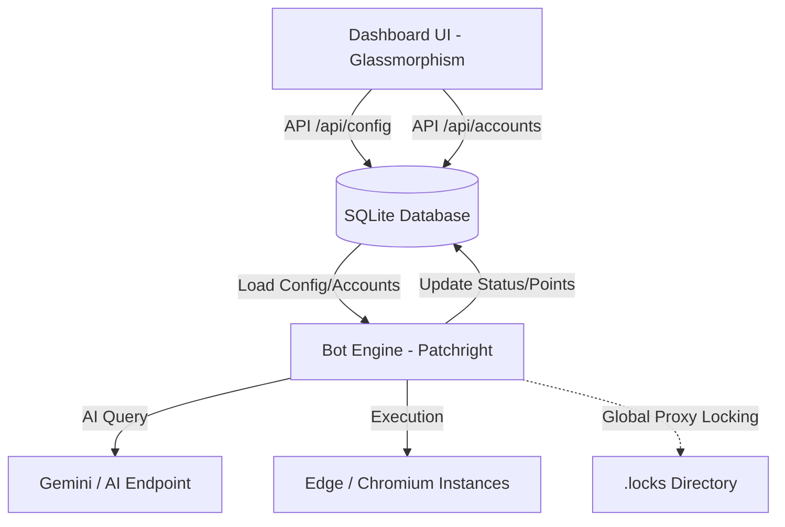

# 🌟 Microsoft Rewards Bot (Patchright Edition)

<div align="center">


**An advanced, high-performance automation ecosystem for Microsoft Rewards, redesigned with a premium Glassmorphism dashboard and 100% database-driven architecture.**

[Explore Features](#-key-features) • [Installation](#-getting-started) • [Architecture](#-system-architecture) • [Disclaimer](#-disclaimer)

</div>

---

## ✨ Why Choose This Bot?

Unlike legacy scripts that rely on messy JSON files and basic automation, the **Patchright Edition** is built for professionals who demand stability, speed, and stealth.

### 🚀 Premium Dashboard UI (Glassmorphism)
- **Real-time Analytics**: Monitor all your accounts from a single, stunning dashboard.
- **Glassmorphism Design**: A sleek, modern interface with transparency and blur effects.
- **Dynamic Thread Control**: Adjust execution clusters and active workers on the fly.
- **Rank Visualization**: Custom luxury badges for **Gold**, **Silver**, and **Standard** members.

### 🛡️ 100% SQLite Persistence
- **Thread-Safe Storage**: No more file locking issues or corrupted JSON files.
- **Automatic Migration**: Old `accounts.json` and `config.json` are automatically imported into SQLite.
- **Concurrent Access**: Dashboard and bot processes read/write simultaneously using WAL mode.

### 🧠 AI-Powered Stealth Searching
- **Natural Interaction**: Uses **Gemini AI** (or OpenAI-compatible endpoints) to generate human-like search queries.
- **Human Behavior**: Strictly follows a **Find -> Hover -> Click** pattern — NO direct URL navigation that leads to detection.
- **Multi-Engine Support**: Search across Google, Wikipedia, Reddit, and Local Bings.

---

## 🛠️ System Architecture



---

## 🚀 Getting Started

### 1. Requirements
- **Node.js**: `v22.0.0` or higher
- **Git**: For updates and source control.

### 2. Quick Install
```bash
# Clone the repository
git clone https://github.com/huynhchinh307/BingEdge.git
cd BingEdge

# Install dependencies
npm install

# Build the project
npm run build
```

### 3. Launching
```bash
# Start the Dashboard
npm run dashboard
```
*Access the interface at `http://localhost:3000`*

---

## ⚙️ Advanced Features

| Feature | Description | Status |
| :--- | :--- | :---: |
| **Global Proxy Lock** | Prevents multiple accounts from using the same proxy simultaneously to avoid bans. | ✅ |
| **Multi-Threading** | Run up to 20 parallel browser instances with shared resource management. | ✅ |
| **Discord Hook** | Real-time notifications for status updates, errors, and daily points total. | ✅ |
| **Auto-Diagnosis** | Automated error detection and recovery logic for stalled browser sessions. | ✅ |
| **Fingerprint Spoofing** | Each account generates a unique browser fingerprint (UA, WebGL, etc.). | ✅ |

---

## 🏗️ Project Structure

- `src/index.ts`: The main entry point for account orchestration.
- `src/util/Database.ts`: Core SQLite engine and data migration logic.
- `scripts/main/dashboard.js`: High-performance API server for the dashboard.
- `scripts/main/dashboard.html`: The frontend UI (Vanila CSS + JS).
- `browser/`: Directory for persistent browser session storage.

---

## ⚠️ Disclaimer

This project is for **educational purposes only**. Use it at your own risk. Automated interaction with Microsoft Rewards may violate their Terms of Service. The maintainers are not responsible for any account bans or losses.

---

<div align="center">
    Maintained with ❤️ by <a href="https://github.com/huynhchinh307">huynhchinh307</a>
</div>
